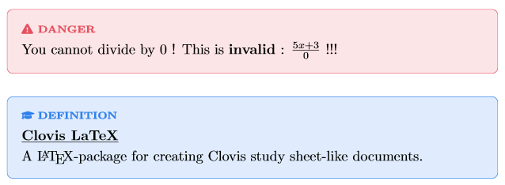

# clovis-latex
A LaTeX package for creating Clovis study sheet-like documents.



Source code :
```tex
\clovisDanger{
    You cannot divide by 0 ! This is \textbf{invalid} : $\frac{5x+3}{0}$ !!!
}

\clovisDefinition{Clovis LaTeX}{
    A \LaTeX-package for creating Clovis study sheet-like documents.
}
```

It is based on the `mdframed` package.
